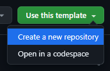

# Competitive Programming Template

This project consists of a template for competitive programming teams, containing automatic PDF generation with code and theory.

## Table of Contents

- [Table of Contents](#table-of-contents)
- [Getting Started](#getting-started)
    - [Cloning this template](#cloning-this-template)
    - [Team information](#team-information)
    - [Generating PDF](#generating-pdf)
        - [Automatic generation](#automatic-generation)
- [How to Use](#how-to-use)
    - [Notebook](#notebook)
        - [Categories](#categories)
        - [Adding a code](#adding-a-code)
        - [Ommiting files from PDF](#ommiting-files-from-pdf)
        - [Examples of notebook](#examples-of-notebook)
    - [Theoretical](#theoretical)
        - [Categories](#categories-1)
        - [Adding a theoretical information](#adding-a-theoretical-information)
        - [Ommiting files from PDF](#ommiting-files-from-pdf-1)
        - [Examples of theoretical](#examples-of-theoretical)
    - [Modifying LaTeX](#modifying-latex)
- [Contributors](#contributors)

# Getting Started

## Cloning this template

Click the "**Use this template**" button in the top right corner, then select "**Create a new repository**", and then fill in the required information.



Now [clone](https://docs.github.com/en/repositories/creating-and-managing-repositories/cloning-a-repository) **your** repository to your machine (or use the [github online editor](https://docs.github.com/en/codespaces/the-githubdev-web-based-editor)).

## Team information

Add information about your team in [template_notebook.tex](generate_latex/template_notebook.tex/) and [template_theoretical.tex](generate_latex/template_theoretical.tex/) (like the name, members, affiliation and so on). You can search for `% CONFIG:` in the files to find where to make changes.

## Generating PDF

Requirements: [Python 3](https://www.python.org/), [pdflatex](http://pdftex.org).

### Ubuntu
```bash
sudo apt install python3
```

```bash
sudo apt install texlive texinfo texlive-fonts-recommended texlive-latex-extra
```

### Arch
```bash
yay -S python3
```

```bash
yay -S texlive texinfo texlive-fonts-recommended texlive-latex-extra
```

### Generating

After installing the above dependencies, run the following commands to generate the pdfs:

```bash
python3 generate_latex/generate_notebook.py
```

```bash
python3 generate_latex/generate_theoretical.py
```

After that, the pdf files will be in the project root folder ([notebook.pdf](notebook.pdf) and [notebook.pdf](theoretical.pdf)).

### Automatic generation

When a push is made to the main branch, updated PDFs will be generated automatically and will [appear on github](https://github.com/tilnoene/competitive-programming-template/releases/tag/latest) after a few minutes. There is no need to perform any additional configuration.

_To avoid conflicts, you can delete the `notebook.pdf` and `theoretical.pdf` files and then do a pull before performing a push._

# How to Use

## Notebook

### Categories

These are the default categories. When adding a folder within the code folder, a new category will be created.

- [Data Structures](code/ds/)
- [Graph](code/graph/)
- [String](code/string/)
- [Geometry](code/geometry/)
- [Math](code/math/)
- [Dynamic Programming](code/dp/)
- [Primitives](code/primitives/)
- [General](code/general)

### Adding a code

To add code, add a `.cpp` file to a category folder.

When adding code, it's a good practice to add more information about it, such as:

```c++
// name of algorithm/structure
//
// description and more information
// 
// links of problems solved with it (to make sure it works)
// 
// complexity (of each funcion, if applicable)

struct Example {
    // code
};
```

### Ommiting files from PDF

You can omit certain files from appearing in the final PDF by adding their name in [block_from_notebook.txt](generate_latex/block_from_notebook.txt).


### Examples of notebook

- [tilnoene](https://github.com/tilnoene/competitive-programming/tree/main/code)
- [brunomaletta](https://github.com/brunomaletta/Biblioteca/tree/master/Codigo)

## Theoretical

### Categories

These are the default categories. When adding a folder within the code folder, a new category will be created.

- [Bitwise](theoretical/Bitwise/)
- [C++](theoretical/C++/)
- [Constants](theoretical/Constants/)
- [Counting Problems](theoretical/Counting%20Problems/)
- [Geometry](theoretical/geometry/)
- [Identities](theoretical/identities/)
- [Math](theoretical/math/)
- [Notes](theoretical/notes)
- [Number Theory](theoretical/Number%20Theory)
- [Progressions](theoretical/Progressions)

### Adding a theoretical information

To add theoretical information, add a `.tex` file to a category folder.

When adding new information, use `\subsection` at the beginning of the file.

```tex
\subsection{Title}

% ...
```

To add text immediately below the category name, add the content to a file named `general.tex`. There's an example [here](theoretical/Progressions/general.tex/).

There's an example of adding an image [here](theoretical/Progressions/general.tex/).

### Ommiting files from PDF

You can omit certain files from appearing in the final PDF by adding their name in [block_from_theoretical.txt](generate_latex/block_from_theoretical.txt).

### Examples of theoretical

- [tilnoene](https://github.com/tilnoene/competitive-programming/tree/main/theoretical)
- [brunomaletta](https://github.com/brunomaletta/Biblioteca/blob/master/pdf/theoretical.pdf)

## Modifying LaTeX

These are the latex templates for the [notebook](generate_latex/template_notebook.tex) and [theoretical](generate_latex/template_theoretical.tex), if you want to modify them.

# Contributors

<a href="https://github.com/tilnoene/competitive-programming-template/graphs/contributors">
  
</a>

<p></p>

Inspired by [Tiagosf00 notebook](https://github.com/Tiagosf00/Competitive-Programming) and [brunomaletta notebook](https://github.com/brunomaletta/Biblioteca).
